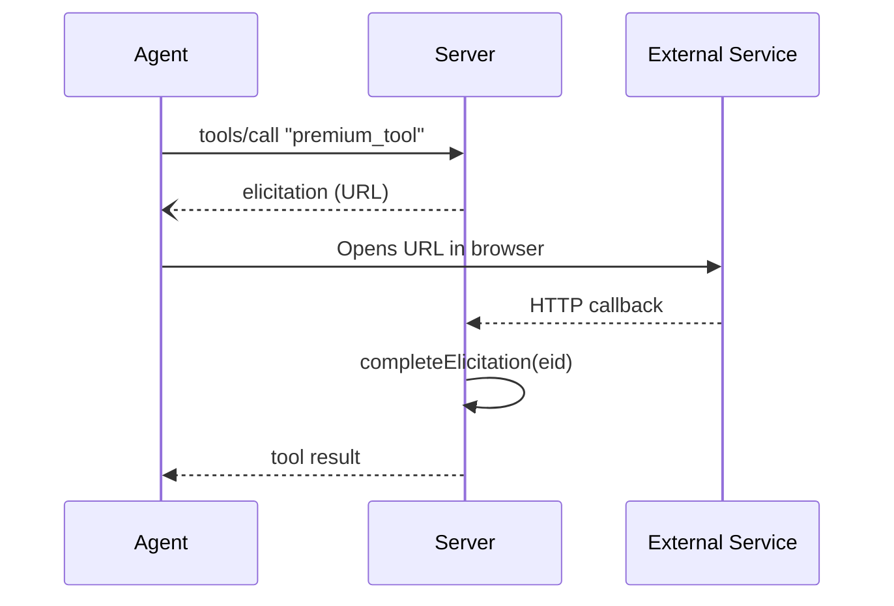

# Elicitation

Elicitation pauses tool execution and asks the user for input. Two modes: **form** for structured data, **URL** for external redirects.

## When to Use

| | Tool input (`args`) | Elicitation (`c.elicit`) |
|---|---|---|
| Timing | Known before the tool is called | Decided at runtime, mid-execution |
| Use case | Required parameters | Conditional prompts, multi-step flows |
| Who initiates | The agent fills in the schema | The tool handler asks the user |

Use tool input when the agent already knows what to pass. Use elicitation when the handler needs to ask the user something based on runtime state — confirmation dialogs, preference forms, OAuth redirects.

## Form Mode

`c.elicit.form(message, zodSchema)` displays a form to the user and returns typed data.

```ts
import { z } from "zod";

server.tool(
  "configure",
  { description: "Set preferences" },
  async (_args, c) => {
    const result = await c.elicit.form(
      "Choose your preferences",
      z.object({
        theme: z.enum(["light", "dark"]).describe("Color theme"),
        language: z.string().describe("Preferred language"),
      }),
    );

    if (result.action !== "accept") {
      return c.text("Configuration cancelled.");
    }

    c.session.set("preferences", result.content);
    return c.text(`Theme: ${result.content.theme}, Language: ${result.content.language}`);
  },
);
```

### Return Value

| Property | Type | Description |
|---|---|---|
| `action` | `"accept" \| "decline" \| "cancel"` | What the user did |
| `content` | `z.infer<typeof schema>` | Form data (typed from your Zod schema) |

Always check `result.action` before accessing `result.content`. If the user declines or cancels, `content` will be an empty object.

## URL Mode

`c.elicit.url(message, url)` directs the user to an external URL. No data is returned — only the user's action.

```ts
const result = await c.elicit.url(
  "Review the terms of service",
  "https://example.com/tos",
);

if (result.action !== "accept") {
  return c.text("You must accept the terms to continue.");
}
```

### With waitForCompletion

For flows where an external service needs to call back (OAuth, payments), use `waitForCompletion: true`. The promise blocks until your callback route calls `server.completeElicitation(eid)`.

```ts
const elicitationId = crypto.randomUUID();

const result = await c.elicit.url(
  "Complete payment to continue",
  `https://pay.example.com/checkout?state=${c.sessionId}:${elicitationId}`,
  { waitForCompletion: true, elicitationId, timeout: 300_000 },
);
```

Your HTTP callback route completes the flow:

```ts
app.get("/payment/callback", async (ctx) => {
  const [sessionId, elicitationId] = ctx.req.query("state")!.split(":");
  mcp.session(sessionId).set("paid", true);
  mcp.completeElicitation(elicitationId);
  return ctx.html("<p>Done! You can close this tab.</p>");
});
```

### Sequence



### URL Options

| Option | Type | Default | Description |
|---|---|---|---|
| `elicitationId` | `string` | Random UUID | Pre-generated ID for callback matching |
| `waitForCompletion` | `boolean` | `false` | Wait for `completeElicitation()` before resolving |
| `timeout` | `number` | `300000` (5 min) | Timeout in ms for waiting |

## Form vs URL

| | Form | URL |
|---|---|---|
| Returns data | Yes (`content` typed from Zod) | No (only `action`) |
| User interaction | Inline form in the client | Browser redirect |
| Use case | Settings, preferences, credentials | OAuth, payments, document signing |
| Transport | stdio + HTTP | HTTP (requires browser) |

## Built-in Middleware

Several built-in middleware use elicitation internally:

| Middleware | Mode | Purpose |
|---|---|---|
| [`credentials()`](/middleware/credentials) | Form | Prompts for username/password |
| [`urlAction()`](/middleware/overview#low-level) | URL | Base for all URL flows |
| [`oauth()`](/auth/overview) | URL | OAuth redirect + callback |
| [`payment()`](/payment/overview) | URL | Payment redirect + callback |

You don't need to call `c.elicit` directly when using these — the middleware handles it.

:::tip Under the hood
`c.elicit.form()` converts the Zod schema to JSON Schema via `inputToJsonSchema()` and calls the SDK's `server.elicitInput()`. For URL mode with `waitForCompletion`, lynq registers the pending elicitation **before** sending the request to the client. This prevents a race condition where the callback arrives before the promise is set up.
:::

## What's Next

- [Sampling](/concepts/sampling) — request LLM inference from the client
- [credentials()](/middleware/credentials) — form-based auth using elicitation
- [Auth Providers](/auth/overview) — OAuth flows using URL elicitation
- [Payment Providers](/payment/overview) — payment flows using URL elicitation
- [API Reference](/api/overview#elicitation) — full options and types
