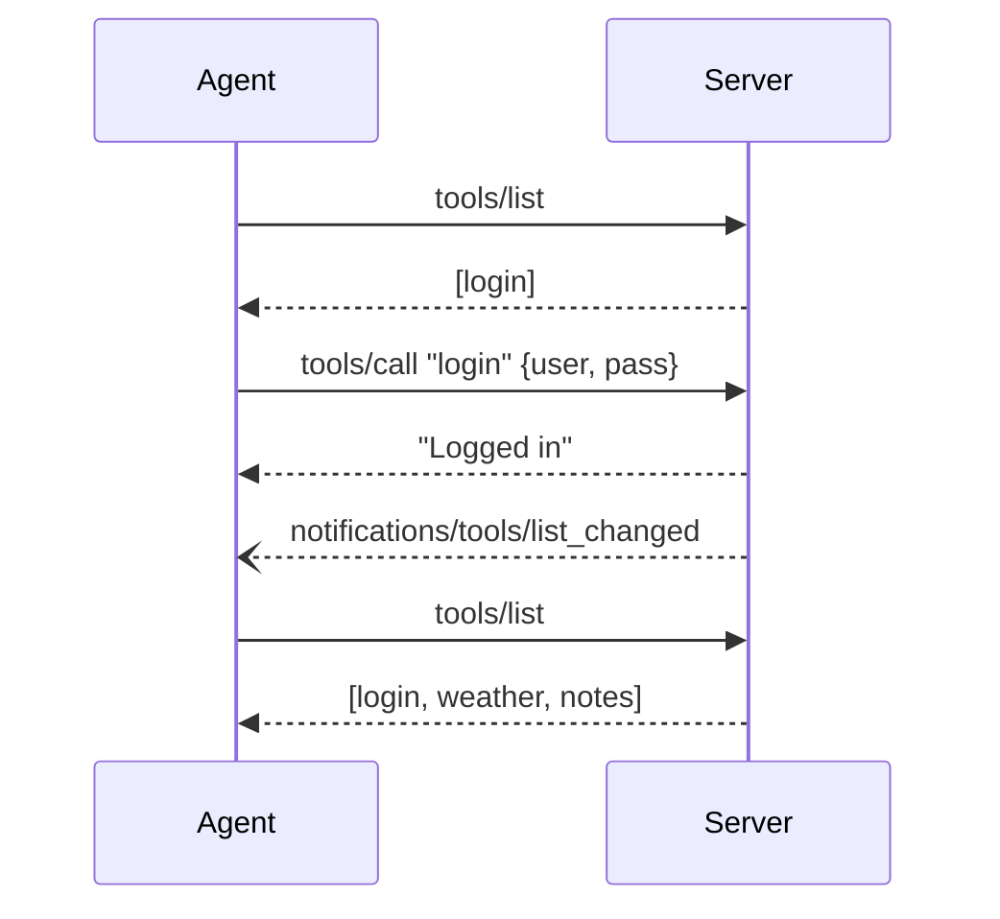

# Session & Visibility

lynq's core concept: tools and resources appear and disappear per session. Every client session has independent state and visibility.

## Session State

Store and retrieve arbitrary data scoped to the current session:

```ts
c.session.set("user", { name: "admin" });
const user = c.session.get<{ name: string }>("user");
```

State is isolated per session. One client's state never leaks to another.

## Visibility Primitives

### authorize / revoke

Reveal or hide **all** tools and resources guarded by a middleware name:

```ts
// In a login handler:
c.session.authorize("guard");  // reveals all guard()-guarded tools and resources

// In a logout handler:
c.session.revoke("guard");     // hides them again
```

### enableTools / disableTools

Reveal or hide **specific** tools by name:

```ts
c.session.enableTools("step2", "step3");
c.session.disableTools("step1");
```

### enableResources / disableResources

Same pattern for resources:

```ts
c.session.enableResources("config://secrets");
c.session.disableResources("config://secrets");
```

## authorize vs enableTools

| | `authorize(name)` | `enableTools(...names)` |
|---|---|---|
| Scope | All tools/resources with that middleware | Specific tools by name |
| Requires middleware | Yes (`onRegister` returning `false`) | No |
| Best for | Bulk access control (auth, plans) | Individual tool toggling (wizards, steps) |

## Sequence Diagram



## guard() Middleware

lynq ships `guard()` as a built-in middleware for the visibility pattern:

```ts
import { guard } from "@lynq/lynq/guard";

// Hidden until c.session.authorize("guard") is called
server.tool("secret", guard(), { description: "Protected" }, handler);
```

`guard()` is intentionally simple -- `onRegister` returns `false`, `onCall` checks a session key. For production, write your own middleware tailored to your auth system. See [Custom Middleware](/middleware/custom).

:::tip Under the hood
Every `authorize()`, `revoke()`, `enableTools()`, `disableTools()`, `enableResources()`, and `disableResources()` call triggers a `notifications/tools/list_changed` or `notifications/resources/list_changed` notification via the MCP SDK's `server.sendToolListChanged()`. The client automatically re-fetches the list and sees the updated visibility. This bidirectional notification is what lynq automates -- you never call `sendToolListChanged` yourself.
:::

## Session vs Store

Session state is connection-scoped -- when the connection drops, it's gone. For state that survives reconnections (user profiles, payment history), use the [Store](/concepts/store):

```ts
// Session: connection-scoped (sync)
c.session.set("temp_token", token);

// Store: persistent (async)
await c.store.set("feature_flags", { newUI: true });
await c.userStore.set("preferences", { theme: "dark" });
```

Auth and payment middleware support a `persistent` option to use `c.userStore` instead of `c.session`:

```ts
server.tool("premium", payment({
  buildUrl: ...,
  persistent: true, // survives reconnection
}), config, handler);
```

## What's Next

- [Elicitation](/concepts/elicitation) -- user input during tool execution
- [Tasks](/concepts/tasks) -- visibility control for tasks
- [Store & Persistence](/concepts/store) -- persistent state across connections
- [Auth Flow](/guides/auth-flow) -- full login/logout example
- [Dynamic Tools](/guides/dynamic-tools) -- onboarding, multi-tenant, wizard patterns
- [Resource Gating](/guides/resource-gating) -- visibility control for resources
