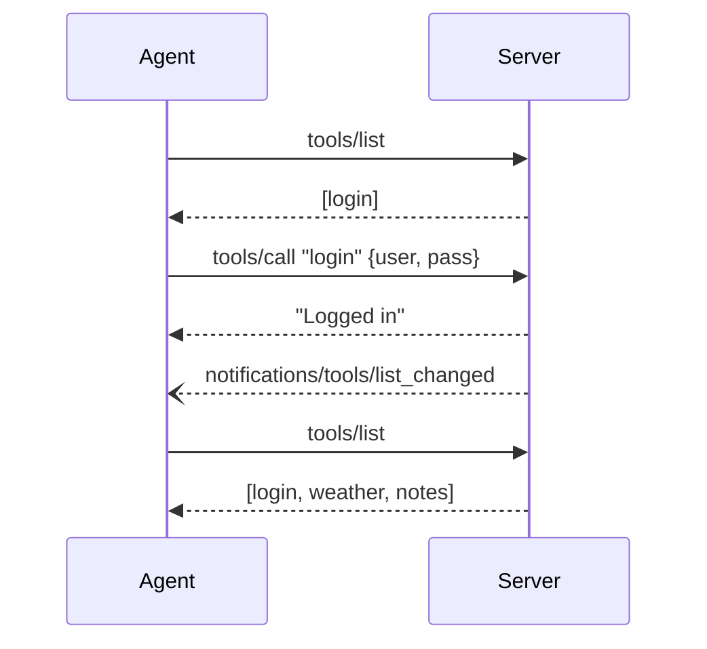

# Auth Flow

A complete login/logout example using lynq's `guard()` middleware. `guard()` demonstrates the session-scoped visibility pattern -- for production, write your own middleware tailored to your auth system (see [Custom Middleware](/guides/custom-middleware)).

## Sequence



## Server Code

```ts
import { createMCPServer } from "@lynq/lynq";
import { guard } from "@lynq/lynq/guard";
import { z } from "zod";

const server = createMCPServer({ name: "my-app", version: "1.0.0" });

// Always visible -- no middleware
server.tool(
  "login",
  {
    description: "Authenticate to unlock protected tools",
    input: z.object({ user: z.string(), pass: z.string() }),
  },
  async (args, ctx) => {
    if (args.user !== "admin" || args.pass !== "secret") {
      return ctx.error("Invalid credentials");
    }

    ctx.session.set("user", { name: args.user });
    ctx.session.authorize("guard");

    return ctx.text("Logged in");
  },
);

// Hidden until guard() is authorized
server.tool(
  "weather",
  guard(),
  {
    description: "Get current weather",
    input: z.object({ city: z.string() }),
  },
  async (args, ctx) => ctx.text(`Sunny in ${args.city}`),
);

// Also hidden until guard() is authorized
server.tool(
  "notes",
  guard(),
  { description: "List saved notes" },
  async (_args, ctx) => {
    const user = ctx.session.get<{ name: string }>("user");
    return ctx.text(`Notes for ${user?.name}`);
  },
);

await server.stdio();
```

:::tip Under the hood
`guard()` returns a middleware with `onRegister() { return false }` -- tools start hidden from `tools/list` responses. `ctx.session.authorize("guard")` grants the `"guard"` middleware for this session. lynq automatically calls `sendToolListChanged` -- you never touch it. The agent re-fetches `tools/list` and sees the newly visible tools. `onCall` still guards execution: if `session.get("user")` is falsy, the call returns an error.
:::

## Logout

```ts
server.tool(
  "logout",
  { description: "Log out and hide protected tools" },
  async (_args, ctx) => {
    ctx.session.set("user", undefined);
    ctx.session.revoke("guard");
    return ctx.text("Logged out");
  },
);
```

After `revoke("guard")`, lynq sends another `tools/list_changed` notification. The agent re-fetches and sees only `[login, logout]`. The protected tools disappear from the tool list.
