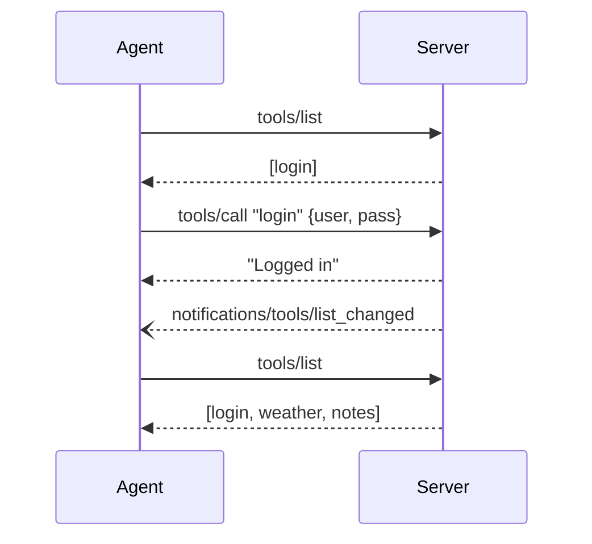

# Auth Flow

lynq provides multiple authentication strategies, from simple visibility gates to full OAuth flows. Choose the one that fits your use case:

| Strategy | Middleware | Use case |
|----------|-----------|----------|
| Manual login tool | `guard()` | Stdio, simple username/password |
| Form-based | `credentials()` | Elicitation-capable clients |
| Bearer token | `bearer()` | HTTP APIs with `Authorization` header |
| JWT | `jwt()` | HTTP APIs with JWT tokens |
| GitHub OAuth | `githubOAuth()` | GitHub sign-in |
| Google OAuth | `googleOAuth()` | Google sign-in |

## Guard (Manual Login)

A simple login/logout example using `guard()`. Best for stdio transport where the agent calls a `login` tool directly.

## Sequence



## Server Code

```ts
import { createMCPServer } from "@lynq/lynq";
import { guard } from "@lynq/lynq/guard";
import { z } from "zod";

const server = createMCPServer({ name: "my-app", version: "1.0.0" });

// Always visible -- no middleware
server.tool(
  "login",
  {
    description: "Authenticate to unlock protected tools",
    input: z.object({ user: z.string(), pass: z.string() }),
  },
  async (args, c) => {
    if (args.user !== "admin" || args.pass !== "secret") {
      return c.error("Invalid credentials");
    }

    c.session.set("user", { name: args.user });
    c.session.authorize("guard");

    return c.text("Logged in");
  },
);

// Hidden until guard() is authorized
server.tool(
  "weather",
  guard(),
  {
    description: "Get current weather",
    input: z.object({ city: z.string() }),
  },
  async (args, c) => c.text(`Sunny in ${args.city}`),
);

// Also hidden until guard() is authorized
server.tool(
  "notes",
  guard(),
  { description: "List saved notes" },
  async (_args, c) => {
    const user = c.session.get<{ name: string }>("user");
    return c.text(`Notes for ${user?.name}`);
  },
);

await server.stdio();
```

:::tip Under the hood
`guard()` returns a middleware with `onRegister() { return false }` -- tools start hidden from `tools/list` responses. `c.session.authorize("guard")` grants the `"guard"` middleware for this session. lynq automatically calls `sendToolListChanged` -- you never touch it. The agent re-fetches `tools/list` and sees the newly visible tools. `onCall` still guards execution: if `session.get("user")` is falsy, the call returns an error.
:::

## Logout

```ts
server.tool(
  "logout",
  { description: "Log out and hide protected tools" },
  async (_args, c) => {
    c.session.set("user", undefined);
    c.session.revoke("guard");
    return c.text("Logged out");
  },
);
```

After `revoke("guard")`, lynq sends another `tools/list_changed` notification. The agent re-fetches and sees only `[login, logout]`. The protected tools disappear from the tool list.

## Other Strategies

For HTTP-based auth and OAuth flows, see the dedicated provider pages:

- [bearer()](/auth/bearer) -- Bearer token verification
- [jwt()](/auth/jwt) -- JWT verification
- [GitHub OAuth](/auth/github) -- GitHub sign-in
- [Google OAuth](/auth/google) -- Google sign-in
- [Auth Providers Overview](/auth/overview) -- choosing the right strategy
