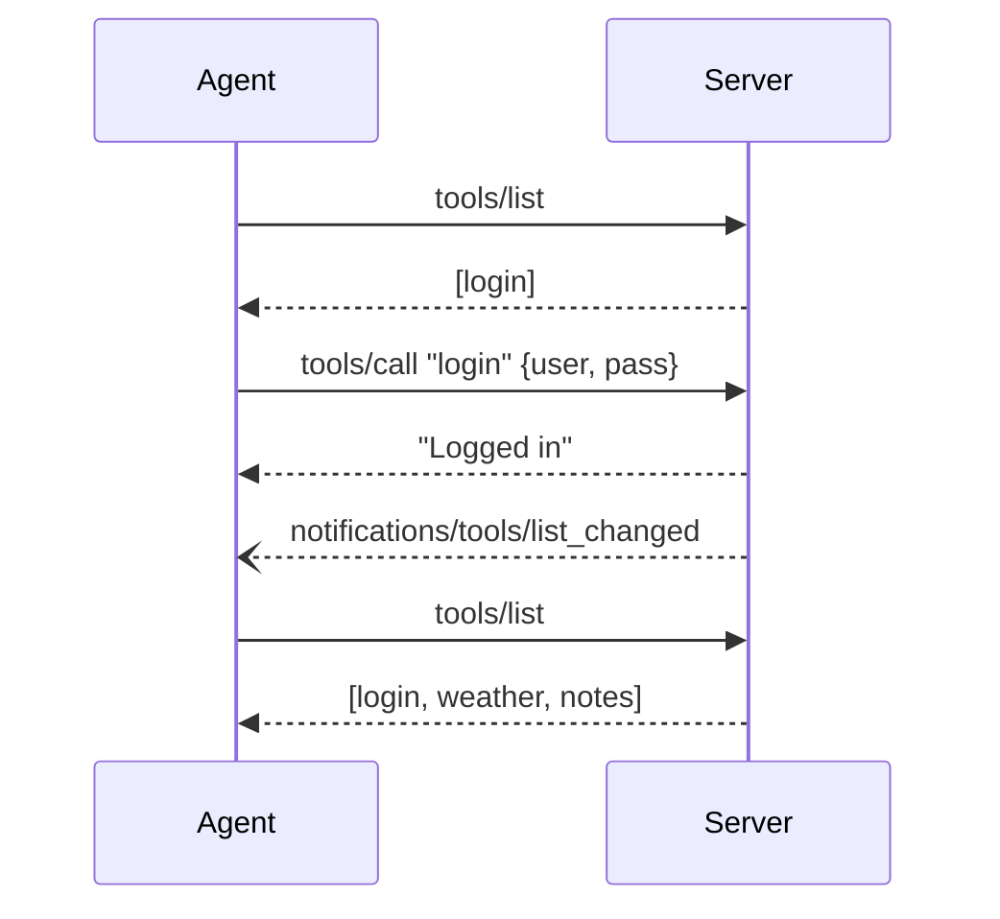

# Auth Flow

lynq provides multiple authentication strategies, from simple visibility gates to full OAuth flows. Choose the one that fits your use case:

| Strategy | Middleware | Use case |
|----------|-----------|----------|
| Manual login tool | `guard()` | Stdio, simple username/password |
| Form-based | `credentials()` | Elicitation-capable clients |
| Bearer token | `bearer()` | HTTP APIs with `Authorization` header |
| JWT | `jwt()` | HTTP APIs with JWT tokens |
| GitHub OAuth | `githubOAuth()` | GitHub sign-in |
| Google OAuth | `googleOAuth()` | Google sign-in |

## Guard (Manual Login)

A simple login/logout example using `guard()`. Best for stdio transport where the agent calls a `login` tool directly.

## Sequence



## Server Code

```ts
import { createMCPServer } from "@lynq/lynq";
import { guard } from "@lynq/lynq/guard";
import { z } from "zod";

const server = createMCPServer({ name: "my-app", version: "1.0.0" });

// Always visible -- no middleware
server.tool(
  "login",
  {
    description: "Authenticate to unlock protected tools",
    input: z.object({ user: z.string(), pass: z.string() }),
  },
  async (args, c) => {
    if (args.user !== "admin" || args.pass !== "secret") {
      return c.error("Invalid credentials");
    }

    c.session.set("user", { name: args.user });
    c.session.authorize("guard");

    return c.text("Logged in");
  },
);

// Hidden until guard() is authorized
server.tool(
  "weather",
  guard(),
  {
    description: "Get current weather",
    input: z.object({ city: z.string() }),
  },
  async (args, c) => c.text(`Sunny in ${args.city}`),
);

// Also hidden until guard() is authorized
server.tool(
  "notes",
  guard(),
  { description: "List saved notes" },
  async (_args, c) => {
    const user = c.session.get<{ name: string }>("user");
    return c.text(`Notes for ${user?.name}`);
  },
);

await server.stdio();
```

:::tip Under the hood
`guard()` returns a middleware with `onRegister() { return false }` -- tools start hidden from `tools/list` responses. `c.session.authorize("guard")` grants the `"guard"` middleware for this session. lynq automatically calls `sendToolListChanged` -- you never touch it. The agent re-fetches `tools/list` and sees the newly visible tools. `onCall` still guards execution: if `session.get("user")` is falsy, the call returns an error.
:::

## Logout

```ts
server.tool(
  "logout",
  { description: "Log out and hide protected tools" },
  async (_args, c) => {
    c.session.set("user", undefined);
    c.session.revoke("guard");
    return c.text("Logged out");
  },
);
```

After `revoke("guard")`, lynq sends another `tools/list_changed` notification. The agent re-fetches and sees only `[login, logout]`. The protected tools disappear from the tool list.

## Bearer Token

For HTTP-based MCP servers where clients send `Authorization: Bearer <token>` headers. The `onRequest` hook bridges HTTP headers into MCP sessions.

```ts
import { createMCPServer } from "@lynq/lynq";
import { bearer } from "@lynq/lynq/bearer";
import { z } from "zod";

const server = createMCPServer({ name: "api", version: "1.0.0" });

server.tool(
  "data",
  bearer({
    verify: async (token) => {
      const user = await db.findUserByToken(token);
      return user ?? null; // return null to reject
    },
  }),
  { description: "Fetch data", input: z.object({ query: z.string() }) },
  async (args, c) => {
    const user = c.session.get("user");
    return c.text(`Hello ${user.name}`);
  },
);

const handler = server.http({
  onRequest(req, sessionId, session) {
    const auth = req.headers.get("Authorization");
    if (auth?.startsWith("Bearer ")) {
      session.set("token", auth.slice(7));
    }
  },
});
```

**Flow:** `onRequest` extracts token from HTTP header → `bearer()` reads it from session → calls `verify()` → stores user and authorizes.

| Option | Type | Default | Description |
|--------|------|---------|-------------|
| `name` | `string` | `"bearer"` | Middleware name |
| `tokenKey` | `string` | `"token"` | Session key for raw token |
| `sessionKey` | `string` | `"user"` | Session key for verified user |
| `verify` | `(token) => Promise<unknown \| null>` | — | Token verification function |
| `message` | `string` | `"Invalid or missing token."` | Error message |

## JWT

Like `bearer()` but automatically decodes and verifies JWTs using `jose`. Install it first:

```sh
pnpm add jose
```

```ts
import { jwt } from "@lynq/lynq/jwt";

server.tool(
  "admin",
  jwt({ secret: process.env.JWT_SECRET! }),
  { description: "Admin panel", input: z.object({}) },
  async (_args, c) => {
    const payload = c.session.get("user"); // decoded JWT payload
    return c.text(`Welcome, ${payload.sub}`);
  },
);
```

Supports symmetric secrets (`secret`) and JWKS endpoints (`jwksUri`):

```ts
// Asymmetric (e.g. Auth0, Firebase)
jwt({ jwksUri: "https://your-tenant.auth0.com/.well-known/jwks.json" })

// With claim validation
jwt({
  secret: "...",
  issuer: "https://your-tenant.auth0.com/",
  audience: "your-api",
  validate: async (payload) => {
    if (payload.role !== "admin") return null;
    return { id: payload.sub, role: payload.role };
  },
})
```

| Option | Type | Default | Description |
|--------|------|---------|-------------|
| `name` | `string` | `"jwt"` | Middleware name |
| `secret` | `string` | — | Symmetric secret (HMAC) |
| `jwksUri` | `string` | — | JWKS endpoint (asymmetric) |
| `issuer` | `string` | — | Expected `iss` claim |
| `audience` | `string` | — | Expected `aud` claim |
| `validate` | `(payload) => unknown \| null` | — | Additional payload validation |
| `tokenKey` | `string` | `"token"` | Session key for raw token |
| `sessionKey` | `string` | `"user"` | Session key for decoded payload |

## GitHub OAuth

Full OAuth flow with URL elicitation. The agent is directed to GitHub's authorization page, and a callback route completes the flow.

```ts
import { createMCPServer } from "@lynq/lynq";
import { githubOAuth, handleGitHubCallback } from "@lynq/lynq/github-oauth";
import { Hono } from "hono";
import { z } from "zod";

const CLIENT_ID = process.env.GITHUB_CLIENT_ID!;
const CLIENT_SECRET = process.env.GITHUB_CLIENT_SECRET!;
const CALLBACK_URL = "http://localhost:3000/auth/github/callback";

const mcp = createMCPServer({ name: "demo", version: "1.0.0" });

mcp.tool(
  "my_repos",
  githubOAuth({
    clientId: CLIENT_ID,
    clientSecret: CLIENT_SECRET,
    redirectUri: CALLBACK_URL,
    scopes: ["read:user", "repo"],
  }),
  { description: "List your GitHub repos", input: z.object({}) },
  async (_args, c) => c.json(c.session.get("user")),
);

const app = new Hono();
const handler = mcp.http();
app.all("/mcp", (c) => handler(c.req.raw));

app.get("/auth/github/callback", async (c) => {
  const result = await handleGitHubCallback(
    mcp,
    { code: c.req.query("code")!, state: c.req.query("state")! },
    { clientId: CLIENT_ID, clientSecret: CLIENT_SECRET },
  );
  if (!result.success) return c.text(`Error: ${result.error}`, 400);
  return c.html("<p>Signed in! You can close this tab.</p>");
});

export default { port: 3000, fetch: app.fetch };
```

**Flow:** Tool call → URL elicitation to GitHub → user authorizes → GitHub redirects to callback → `handleGitHubCallback()` exchanges code for token, fetches user, stores in session, completes elicitation → tool executes.

## Google OAuth

Same pattern as GitHub with Google endpoints. Default scopes: `openid`, `profile`, `email`.

```ts
import { googleOAuth, handleGoogleCallback } from "@lynq/lynq/google-oauth";

mcp.tool(
  "drive_files",
  googleOAuth({
    clientId: process.env.GOOGLE_CLIENT_ID!,
    clientSecret: process.env.GOOGLE_CLIENT_SECRET!,
    redirectUri: "http://localhost:3000/auth/google/callback",
  }),
  { description: "List Google Drive files", input: z.object({}) },
  async (_args, c) => c.json(c.session.get("user")),
);

app.get("/auth/google/callback", async (c) => {
  const result = await handleGoogleCallback(
    mcp,
    { code: c.req.query("code")!, state: c.req.query("state")! },
    {
      clientId: process.env.GOOGLE_CLIENT_ID!,
      clientSecret: process.env.GOOGLE_CLIENT_SECRET!,
      redirectUri: "http://localhost:3000/auth/google/callback",
    },
  );
  if (!result.success) return c.text(`Error: ${result.error}`, 400);
  return c.html("<p>Signed in! You can close this tab.</p>");
});
```

### OAuth Provider Options

Both `githubOAuth()` and `googleOAuth()` share the same option shape:

| Option | Type | Default | Description |
|--------|------|---------|-------------|
| `name` | `string` | `"github-oauth"` / `"google-oauth"` | Middleware name |
| `clientId` | `string` | — | OAuth app client ID |
| `clientSecret` | `string` | — | OAuth app client secret |
| `redirectUri` | `string` | — | Your callback URL |
| `scopes` | `string[]` | `[]` / `["openid", "profile", "email"]` | OAuth scopes |
| `sessionKey` | `string` | `"user"` | Session key for user data |
| `message` | `string` | Provider-specific | Message shown to user |
| `timeout` | `number` | `300000` | Timeout in ms |
