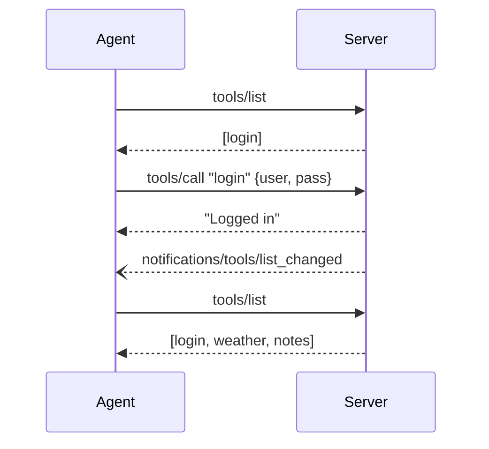

# Auth Flow

lynq's `auth()` middleware controls tool visibility per session. Tools start hidden and appear only after authorization — the framework handles all bidirectional MCP notifications automatically.

## Sequence



## Server Code

```ts
import { createMCPServer, text, error } from "@lynq/lynq";
import { auth } from "@lynq/lynq/auth";
import { z } from "zod";

const server = createMCPServer({ name: "my-app", version: "1.0.0" });

// Always visible — no middleware
server.tool(
  "login",
  {
    description: "Authenticate to unlock protected tools",
    input: z.object({ user: z.string(), pass: z.string() }),
  },
  async (args, ctx) => {
    // Your auth logic here
    if (args.user !== "admin" || args.pass !== "secret") {
      return error("Invalid credentials");
    }

    ctx.session.set("user", { name: args.user });
    ctx.session.authorize("auth");

    return text("Logged in");
  },
);

// Hidden until auth() is authorized
server.tool(
  "weather",
  auth(),
  {
    description: "Get current weather",
    input: z.object({ city: z.string() }),
  },
  async (args) => text(`Sunny in ${args.city}`),
);

// Also hidden until auth() is authorized
server.tool(
  "notes",
  auth(),
  { description: "List saved notes" },
  async (_args, ctx) => {
    const user = ctx.session.get<{ name: string }>("user");
    return text(`Notes for ${user?.name}`);
  },
);

await server.stdio();
```

## What's Happening

- `auth()` returns a middleware with `onRegister() { return false }` — tools start hidden.
- `ctx.session.authorize("auth")` grants the `"auth"` middleware for this session.
- lynq automatically calls `sendToolListChanged` — you never touch it.
- The agent re-fetches `tools/list` and sees the newly visible tools.
- `onCall` still guards execution: if `session.get("user")` is falsy, the call returns an error.

## Logout

```ts
server.tool(
  "logout",
  { description: "Log out and hide protected tools" },
  async (_args, ctx) => {
    ctx.session.set("user", undefined);
    ctx.session.revoke("auth");
    return text("Logged out");
  },
);
```

After `revoke("auth")`, lynq sends another `tools/list_changed` notification. The agent re-fetches and sees only `[login, logout]`. The protected tools disappear from the tool list.
